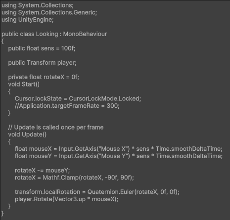
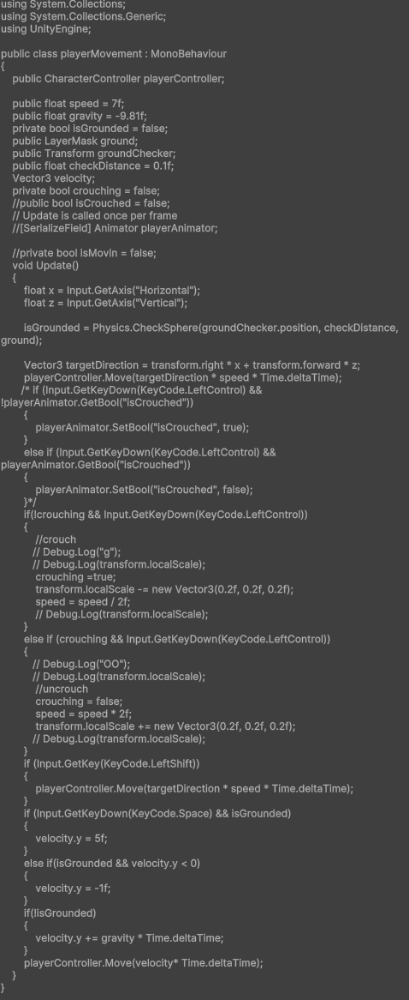
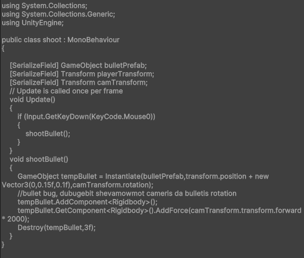
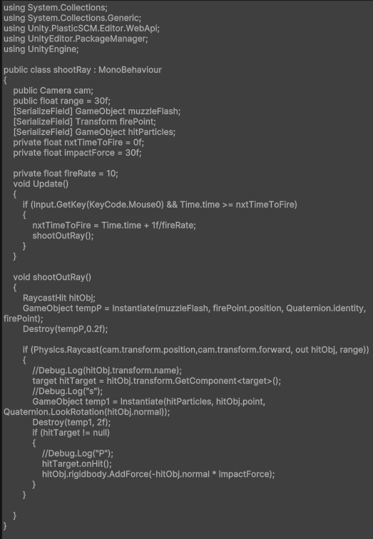
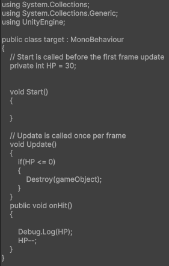
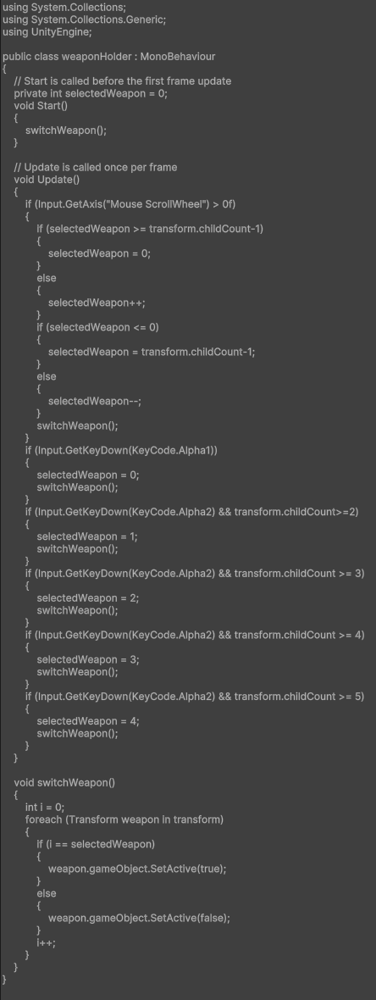

# Swift-Shooter
This Project Used lot of lines of code, here are some of them:
- looking around script for first person camera:
- 
- movement for first person (including sprinting, crouching, jumping):
- 
- shooting phisical bullets:
- 
- shooting Rays (used Raycasting):
- 
- targets small script, for HP reduction control:
- 
- Script for switching between Weapons:
- 
- Ect.
